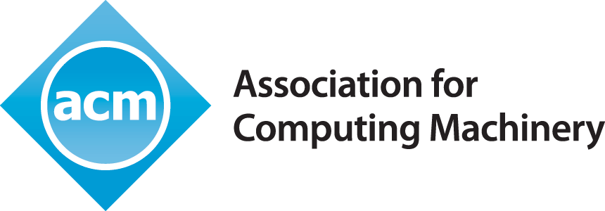

# IEEE/ACM International Symposium on Code Generation and Optimization Call for Student Research Competition (SRC) 

IEEE/ACM International Symposium on Code Generation and Optimization Call for Student Research Competition (SRC)
The ACM Student Research Competition (SRC) offers a unique forum for undergraduate and graduate students to present their original research before a panel of judges and attendees at CGO. Participants must be undergraduates or graduate students pursuing an academic degree at the time of initial submission. Participants must be current student members of the ACM. The abstracts will be examined by a selection committee and selected abstracts will be invited to present as posters at the conference. SRC poster submissions are, in addition, evaluated by a jury during the poster session at the conference. The best three posters are then invited to give a short presentation (10 minutes + 5 minutes questions) on the next day. Based on the submitted abstract, the poster, and the presentation, the winner of CGO's Student Research Competition will be selected, who will receive an award. In addition, the winner will be invited to participate in the grand 2020 ACM SRC competition. Further information on the ACM SRC is available at: [src.acm.org](http://src.acm.org).

# Travel grant application (deadline: TBD)
Please note that the qualified students will be supported by a travel grant. Please find more information regarding the travel grants at [this page](https://cgo-conference.github.io/cgo2020/travel/).

# SRC Chair
Changhee Jung (Purdue University)

See [this page]().

# Selection Committee (TBD)
-	Aaron Smith (Microsoft/Univ. of Edinburgh)
-	Changwan Hong (MIT)
- Bin Ren (College of William and Mary)
- Jagadish Kotra (AMD Research)
- Yongjun Park (Hanyang University, Korea)
- Simone Campanoni (Northwestern University)

# Submission Information
**Submission must be about unpublished work that is not under review anywhere.** Extended abstracts of up to 500 words should be submitted by email to **chjung@purdue.edu** on or before December 15, 2019. All submissions will be reviewed by a selection committee. Notifications will be sent out by January 2, 2020.

Please format your submission using the SIGPLAN format found [here](http://www.sigplan.org/Resources/Author/). Use one 8.5″x11″ single spaced, double-column page, with 10pt or larger font. Include your name and the name of your advisor(s). Optionally, send a pdf of the poster you plan to present (this does not have to be the final version of the poster).

# Timeline
-	Submission: **December 15th, 2019** (AoE)
-	Notification: **Jan 2nd, 2020**

# Submission Topics
As in previous years, CGO will host a Student Research Competition (SRC) session. Submissions in the form of an extended abstract (details above) are solicited in any topics relevant to the main conference, including:

-	Code Generation, Translation, Transformation, and Optimization for performance, energy, virtualization, portability, security, or reliability concerns, and architectural support
-	Efficient execution of dynamically typed and higher-level languages Optimization and code generation for emerging programming models, platforms, domain-specific languages
-	Dynamic/static, profile-guided, feedback-directed, and machine learning based optimization
-	Static, Dynamic, and Hybrid Analysis for performance, energy, memory locality, throughput or latency, security, reliability, or functional debugging
-	Program characterization methods
-	Efficient profiling and instrumentation techniques; architectural support
-	Novel and efficient tools
-	Compiler design, practice and experience
-	Compiler abstraction and intermediate representations
-	Vertical integration of language features, representations, optimizations, and runtime support for parallelism
-	Solutions that involve cross-layer (HW/OS/VM/SW) design and integration
-	Deployed dynamic/static compiler and runtime systems for general purpose, embedded system and Cloud/HPC platforms
-	Parallelism, heterogeneity, and reconfigurable architectures
-	Optimizations for heterogeneous or specialized targets, GPUs, SoCs, CGRA
-	Compiler-support for vectorization, thread extraction, task scheduling, speculation, transaction, memory management, data distribution and synchronization

# Sponsors

 
